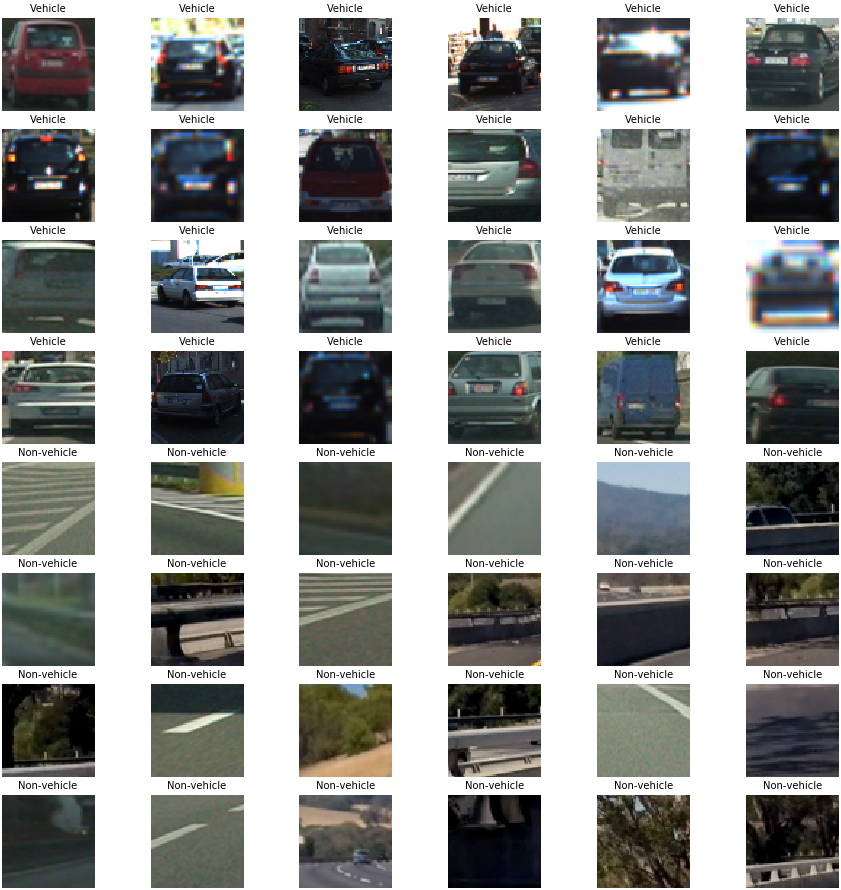

# Vehicle Detection and Tracking

[](http://www.udacity.com/drive)

## Overview
---

The goal of this project is to write a software pipeline to detect vehicles and identify their locations in a video captured of a front facing camera that is mounted on the vehicle's center. The project should:

* Perform a Histogram of Oriented Gradients (HOG) feature extraction on a labeled training set of images and train a Linear SVM classifier
* Apply a color transform and append binned color features, as well as histograms of color, to the HOG feature vector.
* Normalize the features and randomize a selection for training and testing.
* Implement a sliding-window technique and use on the trained classifier to search for vehicles in images.
* Run the pipeline on a given video stream (`test_video.mp4` and on full `project_video.mp4`) and create a heat map of recurring detections frame by frame to reject outliers and follow detected vehicles.
* Estimate a bounding box for vehicles detected.

 

The project is submitted with the following structure: 
* `Vehicle-Detection-and-Tracking.ipnyb` (The main code and test images)
* `README.md` a report writeup file (markdown)
* `videos/` (contains the generated videos resulted from the pipeline)

## Implementation
---

The vehicle detection and tracking in a video stream is implemented as below:

* Reading the training data
* Feature extraction helper functions
* Extracting vehicle and non-vehicle features
* Scalling and splitting features
* Train the linear SVM classifier
* Pipeline to detect vehicles
* Apply the vehicle detection to the video

These steps are described in the upcoming sections. The full implementation is available here: [jupyter notebook](Vehicle-Detection-and-Tracking.ipynb)


### Reading the training data

The provided training data is imported, which includes **8792** Vehicle as well as **8968** non-vehicle images. Below are some of the imorted images from both categories depicted:

Here's an example of the dataset:




### Feature extraction helper functions

In order to extract the required features from the dataset, some helper functions were developed. These are explained in detail as below.


```python
def get_hog_features(img, orient=10, pix_per_cell=8, cell_per_block=2, vis=False)
```
This function accepts params and returns a histogram of Oriented Gradients (HOG for short) as features and an optional matrix for visualization. THe following parameters were used:
 - `10` orientations
 - `8` pixels per cell
 - `2` cells per block

The following pictures demonstrate some examples where the HOG features are extracted for both vehicle and non-vehicle images.


```python
def bin_spatial(img, size=(32, 32))
```
This function is used to convert any input image into a feature vector that can be feeded to the classifier. The `cv2.resize().ravel()` is called to create the feature vector that has onle one single dimension


```python
def color_hist(img, nbins=32, bins_range=(0, 256))
```
This function computes the histogram of the RGB channels separately and concatenate the histograms into a single feature vector. The  color channels are separated using `numpy's` `histogram()` function.


```python
def extract_features(img, 
                      hog_features = [],
                      x=0, 
                      y=0, 
                      s=64,                            
                      spatial_size=(32, 32),
                      orient=10, 
                      pix_per_cell=8, 
                      cell_per_block=2)
```
This function utilitzes the functions metioned above to compute spatial features, HOG features and histogram features on a given image, and then returns the concatenation of all of the extracted features.
   


```python
def extract_training_features(images)
```
And finally, this function converts a set of given images to the YCrCb color space, and the calls `extract_features()` to extract their features. 


### Scalling and splitting features

To normalize the features, it is is necessary to remove the mean and scale the features into single varience. This is done using `StandardScaler()` from `sklearn.preprocessing()` to achieve a normally distributed dataset. 

Also, the training dataset is split up data into randomized training and test sets. To do that, the `train_test_split()` function is used. The training and test sets are split up by a factor of 0.2.


### Training the linear SVM classifier

The training data and their labels are given to a linear SVM (`sklearn.svm's LinearSVC`) classifier for it to be trained. Using the test set we were able to achieve an an accuray of **98.874%**


### Pipeline to detect vehicles

To detect vehicles, a sliding window is pass over the input images. The vehicle location and size is estimated in different parts of the image to improve the performance. The sliding window size is adapted based on the area that we're looking for the vehicles. In the regions closer to the lower part of the image, a large sliding window was used. As we move further away, the sliding window becomes smaller, because the vehicles should also appear smaller.

To improve its performance we estimated the vehicle location and size in diferent areas of the image. In the region closer to the bonet, lower in the image, we use a larger window size, as opposed to the distant regions, where the vehicles appear smaller. This scaling of the sliding window goes from **30%** of the original frame size, up to **80%**.

The `Pipeline` class contains three important functions:

* `_pass_sliding_window()`: Is in charge of passing the sliding windows in different sizes over the input image for feature extraction, and using of the classifier to predict the existance of a vehicle
* `_merge_detections()`: Creates a heatmap, applies a threshold to remove false positives, and finally consolidates the detections to identify the vehicles in the image. To avoid false positives we assume that the images are an ordered sequence, and therefore we can remove those detections that do not fit the history of already detected vehicles.
* `run()`: runs the above mentioned functions on the given input images, and overlays rectangles over the image where a vehicle is detected.

Below are some of the examples of the identified vehicles and their corresponding heatmap:


### Apply the vehicle detection to the video

Finally, we pass the project video to the piepline to detect vehicles. This is done using the `detect_vehicles_in_video()` function. The output video is available here: [project video](videos/project_video_detected.mp4)


## Discussion
---

In the [project video](videos/project_video_detected.mp4), 2 vehicles are clearly identified. The problem is that the pipeline is very slow and takes around 30 minutes to generate the output video. In the real time, this can be fixed by utilizing more optimized algorithms, and  a better hardware like a GPU to perform parallel processing of the video stream. This approach does not take more complicated scenarios into consideration. To detect other traffic participants, like the motorcycles, trucks etc., we need more robust classification methods. Additionally, in case of differnt driving scenarios like bad weather, different road terrain, or different lighting conditions, this approach will most likely fail.